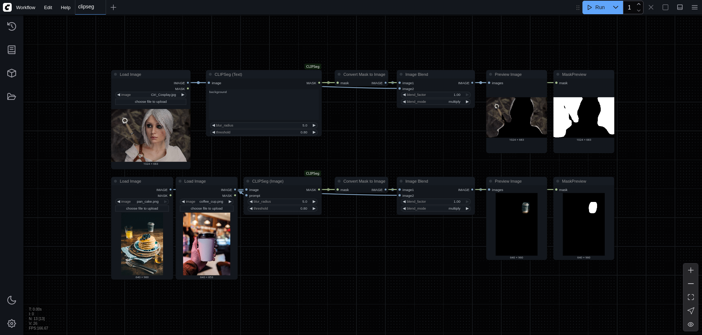

# ComfyUI-CLIPSeg

Using [CLIPSeg model](https://huggingface.co/docs/transformers/main/en/model_doc/clipseg) to generate masks for image inpainting tasks based on text or image prompts.



## Installation

1. Navigate to your ComfyUI custom nodes directory:

   ```bash
   cd /path/to/your/ComfyUI/custom_nodes
   ```

2. Clone this repository:

   ```bash
   git clone git@github.com:zhengxyz123/ComfyUI-CLIPSeg.git --depth=1
   ```

3. Restart ComfyUI.

The plugin will automatically download the [CIDAS/clipseg-rd64-refined](https://huggingface.co/CIDAS/clipseg-rd64-refined) model on first use.

If you have installed ComfyUI properly then there is no need to install any additional dependencies.

## Usage

After installation, find the new nodes under the `mask` category in ComfyUI:

- **CLIPSeg (Text)**: Enter one or more prompts separated by commas.

- **CLIPSeg (Image)**: Connect your input image and a reference image as prompt.
